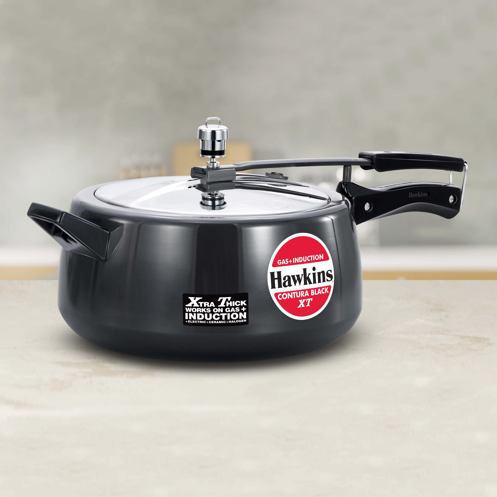

# 🍳 Hawkins Pressure Cookers & Cookware — Interactive Web Showcase

A premium, interactive web application built for **Hawkins Cookers Limited**, showcasing 17 iconic pressure cooker models with 360° 3D MP4 turntable videos, a smart family size capacity calculator, multi-view studio galleries, and side-by-side spec comparison.



---

## 📌 GitHub Repository Short Description
> *A modern, interactive product showcase & smart size finder web app for Hawkins Pressure Cookers built with React, Vite, TypeScript, and custom dark studio UI/UX.*

### 🏷️ Recommended GitHub Topics / Tags
`react` • `vite` • `typescript` • `hawkins` • `pressure-cooker` • `3d-viewer` • `cookware` • `ui-ux` • `dark-mode` • `product-showcase`

---

## ✨ Key Features

- **🎬 360° Interactive 3D Turntable**: Real-time MP4 video loops (`CL.mp4`, `bb.mp4`, `cob.mp4`, etc.) allowing customers to inspect cookers from every angle.
- **🧮 Smart Capacity & Family Size Finder**: Recommends exact liter sizes (1.5L to 30L) based on family size (1-2 persons up to 50+ commercial catering).
- **🎨 Luxury Dark Studio & Hawkins Red Theme**: Custom CSS design system combining Hawkins Red (`#C8102E`), Obsidian surfaces (`#0B0D12`), and Google Fonts (*Plus Jakarta Sans* & *Inter*).
- **🛒 Filterable Product Catalog**: Browse 17 Hawkins cookers across 7 series (*Hard Anodised, Stainless Steel, Aluminum, Tri-Ply, Ceramic, Economy, Specialty*) with search & induction compatibility filters.
- **🖼️ Multi-View Media Modal**: Switch seamlessly between **3D MP4 Video**, **Dark Studio Backdrop**, **Engineering Cutaway View**, and **Transparent WebP Render**.
- **⚖️ Side-by-Side Spec Comparison Matrix**: Compare up to 3 cookers simultaneously across materials, thickness, stove compatibility, capacity, and price.
- **🛡️ Hawkins Safety Tech Callouts**: Explains patented inside-fitting lid safety lock, shielded safety valve, and pressure regulation.
- **📄 PDF Price List Integration**: Direct view and download link for the official Hawkins Price Catalog.

---

## 🛠️ Technology Stack

- **Framework**: [React 18](https://react.dev/) + [Vite 6](https://vitejs.dev/)
- **Language**: [TypeScript](https://www.typescriptlang.org/)
- **Styling**: Modern Vanilla CSS with CSS Variables, Glassmorphism & Custom Keyframe Animations
- **Icons**: [Lucide React](https://lucide.dev/)
- **Typography**: Google Fonts (*Plus Jakarta Sans* & *Inter*)

---

## 📁 Repository Directory Structure

```
09 hawkins/
├── 3d/                       # 3D rotation MP4 video loops (CL, bb, ce, co, cob, cobxt, mm)
├── balck background intial/  # High-res dark studio hero JPEGs
├── data's/cooker/            # Transparent WebP product renders
├── splitted/                 # High-res engineering split cutaway JPEGs
├── src/
│   ├── components/
│   │   ├── Header.tsx        # Navigation, search, PDF link & counters
│   │   ├── Hero.tsx          # 3D video loop hero spotlight & model switcher
│   │   ├── CapacityCalculator.tsx # Family size matching calculator
│   │   ├── ProductCatalog.tsx# Filterable catalog grid
│   │   ├── ProductCard.tsx   # Individual product card
│   │   ├── ProductModal.tsx  # Multi-media modal & technical specs
│   │   ├── ComparisonDrawer.tsx # Side-by-side comparison matrix
│   │   ├── SafetyShowcase.tsx# Hawkins safety engineering callouts
│   │   └── Footer.tsx        # Corporate office info & quick links
│   ├── data/
│   │   └── products.ts       # Structured product database (specs, prices, file paths)
│   ├── App.tsx               # Main application layout & state management
│   ├── index.css             # Brand tokens, dark theme & utility classes
│   └── main.tsx              # React DOM entrypoint
├── PriceList.pdf             # Official Hawkins Price List PDF document
├── index.html
├── package.json
├── tsconfig.json
└── vite.config.ts
```

---

## 🚀 Quick Start & Installation

### Prerequisites
- [Node.js](https://nodejs.org/) (v18.0 or higher recommended)
- `npm` or `yarn`

### Setup Steps

1. **Clone the repository**:
   ```bash
   git clone https://github.com/your-username/hawkins-cookware-showcase.git
   cd hawkins-cookware-showcase
   ```

2. **Install dependencies**:
   ```bash
   npm install
   ```

3. **Start the local development server**:
   ```bash
   npm run dev
   ```
   Open your browser at `http://localhost:3000` to view the app!

4. **Build for production**:
   ```bash
   npm run build
   ```

---

## 🏷️ Products Featured

| Model Name | Series | Material & Base | Induction | Available Litres |
| :--- | :--- | :--- | :---: | :--- |
| **Hawkins Classic** | Aluminum | Virgin Aluminum | ❌ | 1.5L - 12L |
| **Hawkins Contura** | Contura | Curved Virgin Aluminum | ❌ | 1.5L - 6.5L |
| **Hawkins Contura Black** | Hard Anodised | Hard Anodised Aluminum | ❌ | 1.5L - 6.5L |
| **Hawkins Contura Black XT** | Hard Anodised | 4.88mm Extra Thick Anodised | ⚡ | 1.5L - 5L |
| **Hawkins Futura** | Hard Anodised | MoMA Award Winner Design | ❌ | 2L - 9L |
| **Hawkins SS Futura** | Stainless Steel | 18/8 Surgical Stainless Steel | ⚡ | 3L - 7L |
| **Hawkins Bigboy** | Commercial | Heavy Gauge Aluminum | ❌ | 14L - 30L |
| **Hawkins Ceramic** | Ceramic | German Non-Stick Ceramic | ❌ | 2L - 5L |
| **Hawkins Ceramic NS** | Ceramic | Eco Non-Toxic Ceramic | ⚡ | 3L - 5L |
| **Hawkins Miss Mary** | Economy | Tested Virgin Aluminum | ❌ | 1.5L - 8.5L |
| **Hawkins Miss Mary Handi** | Economy | Curved Aluminum Handi | ❌ | 2L - 5L |
| **Hawkins Stainless Steel** | Stainless Steel | 18/8 SS with Sandwich Bottom | ⚡ | 2L - 10L |
| **Hawkins SS Contura** | Stainless Steel | Curved 18/8 Stainless Steel | ⚡ | 1.5L - 5L |
| **Hawkins Tri-Ply SS** | Tri-Ply | 3-Ply Full Body Clad Steel | ⚡ | 2.5L - 5L |
| **Hawkins Cerenity** | Specialty | Anodised Body with Designer Lid | ❌ | 3L - 5L |
| **Hawkins Insta** | Specialty | Rapid Steam Aluminum Alloy | ❌ | 3L - 5L |
| **Hawkins Quick** | Specialty | High Pressure Aluminum | ❌ | 3L - 5L |

---

## 📜 Disclaimer & Brand Attribution

This project is a design & web showcase concept built for **Hawkins Cookers Limited**. Product names, logos, trademarks, and media assets belong exclusively to Hawkins Cookers Limited.
